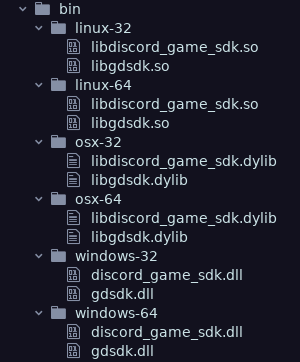

# GodotDiscordSDK Project Template

This is a template for creating Godot projects that use the GodotDiscordSDK GDNative plugin.

## Installation

- Clone the repo: `git clone https://github.com/LennyPhoenix/GodotDiscordSDK-ProjectTemplate.git`
- Set up the binaries:
  - Automatic installation:
    - Windows: `setup.bat`
    - Linux/OSX: `sh setup.sh`
  - Manual:
    - Create 6 folders in the bin/ folder of the repo:
      - `linux-32/`
      - `linux-64/`
      - `osx-32/`
      - `osx-64/`
      - `windows-32/`
      - `windows-64/`
    - Download and extract the [Discord SDK](https://dl-game-sdk.discordapp.net/2.5.6/discord_game_sdk.zip).
    - From the lib/ folder of the Discord SDK:
      - Copy `x86/discord_game_sdk.dll` to the repo's `bin/windows-32/`.
      - Copy `x86_64/discord_game_sdk.dll` to the repo's `bin/windows-64/`.
      - Copy `x86_64/discord_game_sdk.so` to the repo's `bin/linux-32/` and `bin/linux-64/` directories as `libdiscord_game_sdk.so`.
      - Copy `x86_64/discord_game_sdk.dylib` to the repo's `bin/osx-32/` and `bin/osx-64/` directories as `libdiscord_game_sdk.dylib`.
  - For each operating system you target:
    - Download the library binaries from [GitHub Actions](https://github.com/LennyPhoenix/GodotDiscordSDK/actions).
      - If you are unsure whether to choose to choose Debug or Release, Release is recommended.
      - Make sure to download both the 32 and 64-bit versions.
    - Place the binaries in the corresponding bin/ folder:

      

- Run the project to test.
- Get started with [the docs](https://github.com/LennyPhoenix/GodotDiscordSDK/wiki).
